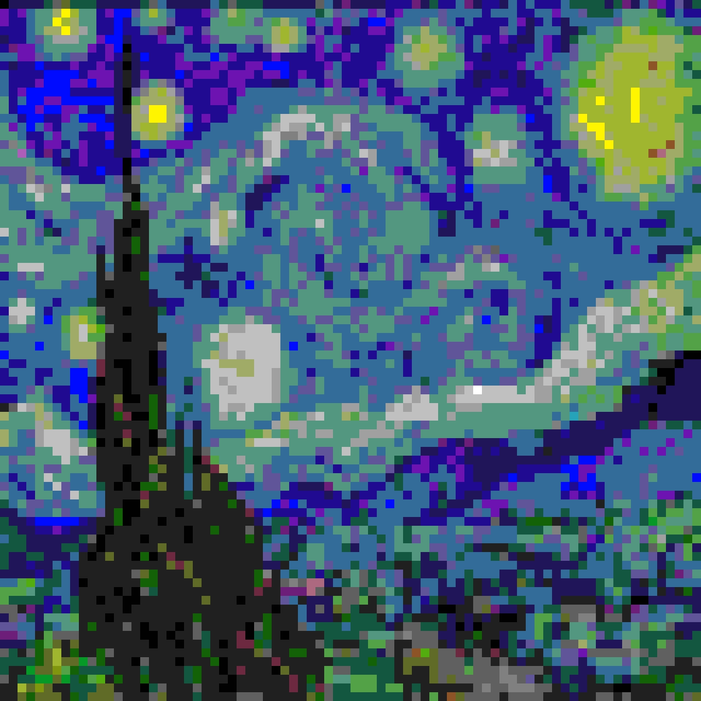

# eightbit

A converter to create shitty 8-bit like images.

## Usage

To install:

```
go install github.com/spudtrooper/eightbit
```

To run:

```
~/go/bin/eightbit --input <INPUT> --output <OUTPUT>
```

## Examples

In | Out
-- | ---
| {width:300px;}
{width:300px;} | {width:300px;}
{width:300px;} | {width:300px;}
